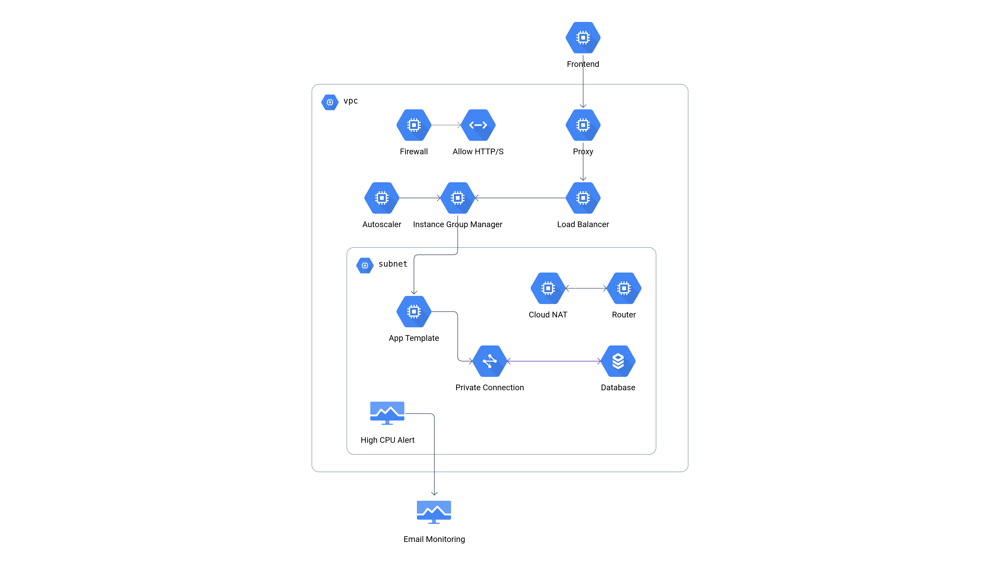

# Ft_IaC - Infrastructure as Code

This project deploys a highly available, scalable web application infrastructure on Google Cloud Platform using Terraform.


## 🏗 Architecture

The infrastructure acts as a transparent layer for the application, ensuring High Availability (HA) and Security.




### Key Components

- **Global Load Balancer**: Distributes traffic to healthy instances.
- **Auto-Scaling Group**: Automatically adjusts between 2 and 4 instances based on CPU load.
- **Cloud SQL**: Managed MySQL 8.0 instance with Private IP only (no public access).
- **Cloud NAT**: Allows private instances to access the internet (for updates/installations) without exposing them.
- **Monitoring**: Alerts triggers via Email if CPU usage exceeds defined threshold.


## Usage

### Prerequisites
- Google Cloud Platform account with billing enabled
- `gcloud` CLI installed and authenticated (`gcloud auth application-default login`)
- `terraform` installed
- `mkdocs` installed

### Documentation
Build and serve doc locally using mkdocs
```bash
cd iac-doc
pip install -r requirements.txt
mkdocs build
mkdocs serve
```

### Configuration
1. **Initialize** the project:
   ```bash
   terraform init
   ```

2. **Configure Variables**:
   Copy the example variables file:
   ```bash
   cp terraform.tfvars.example terraform.tfvars
   ```
   Edit `terraform.tfvars`:
   - Set your `gcp_project_name`.
   - Configure `alert_email` for notifications.

3. **Deploy**:
   ```bash
   terraform apply
   ```

#### Possible values for region and machine type:

|  | Description | Values | Default |
|----------|-------------|---------|---------|
| `gcp_region` | Deployment Region | `US`, `Europe`, `Asia` | `US` |
| `machine_type` | Instance Size | `small`, `medium`, `large` | `small` |


## 🛡 Security & Compliance

- **Secrets Management**: `terraform.tfvars` is git-ignored. Database passwords are changed via variables, never hardcoded.
- **Network Isolation**: Database and App instances have **no public IPs**.
- **Least Privilege**: Application connects to DB via specific user credentials.


## 🧹 Cleanup

To destroy the infrastructure and stop billing:
```bash
terraform destroy
```

*Note: If `service_networking_connection` fails to delete due to dependencies, run `terraform state rm google_service_networking_connection.private_vpc_connection` and try again.*
